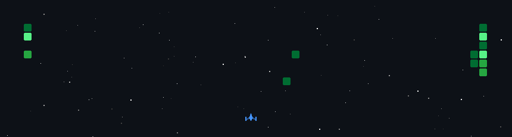

# Hi, I'm Tanveer Ahmed Ziad 👋

**CSE Undergraduate @ Green University of Bangladesh**  
Building with **TypeScript, Next.js, HTML5 Canvas, Three.js & Python** — exploring AI, creative technology, and modern web experiences.

---

## About Me

I'm a Computer Science and Engineering student interested in **AI, software development, and creative technology**. I enjoy turning ideas into practical projects, experimenting with new technologies, and learning by building.

Currently, I'm exploring **AI Engineering, interactive web experiences, and full-stack development**, while also working on projects that combine technology with real-world problems.

I also enjoy **design, visual storytelling, event leadership, and team coordination** — basically, I like both the code *and* the chaos behind making things happen.

---

## Tech Stack

### Development

### Tools

---

## Featured Projects

### 🏙️ [Project_CityZen](https://github.com/TanveerZiad/Project_CityZen)
An urban intelligence and safety platform combining maps, civic information, reporting, and AI-assisted features.

**Next.js · TypeScript · Django REST Framework · Leaflet.js · OpenStreetMap · JWT · Vercel**

### 💻 [Green University Computer Club Website](https://gucc.green.edu.bd/)
Contributed to the frontend development of GUCC's official website, focusing on responsive UI components and user experience.

**Next.js · TypeScript · Responsive UI**

---

## Beyond Code

- President — **Green University Computer Club**
- Event Leadership & Coordination
- Public Speaking
- Strategic Planning
- Visual Storytelling
- Design & Multimedia

---

## Connect

  
  
  
  
  

---

  <i>Building, learning, experimenting — one project at a time.</i>

